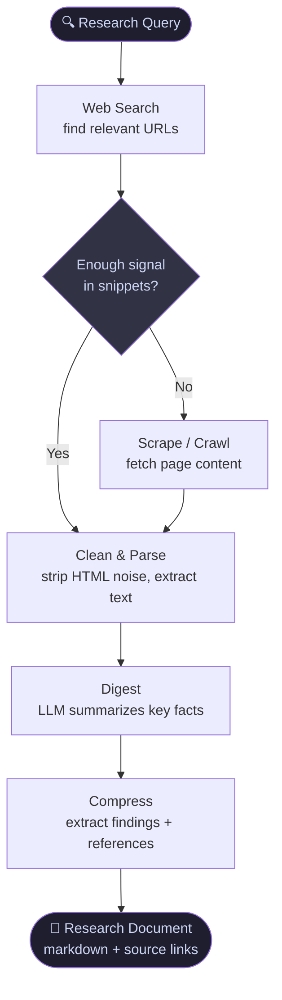

# researcher

> A tool-agnostic research subagent for any LLM assistant (Claude Code, OpenCode, Codex, etc.)
> Goal: find → clean → digest → compress → store. Minimize tokens, maximize signal.

Spawn it for any research task to keep your main context clean and token-efficient.

---

## The Pipeline



| Step | What happens | Token cost |
|------|-------------|------------|
| **1. Web Search** | Query → list of URLs + snippets | Low |
| **2. Scrape/Crawl** | Fetch pages — only if snippet isn't enough | High if raw HTML |
| **3. Clean & Parse** | Strip ads, nav, scripts → plain text | Saved here |
| **4. Digest** | LLM reads cleaned text → extracts facts | Medium |
| **5. Compress** | Findings written to file, raw content discarded | Context freed |
| **6. Store** | Markdown doc with inline references | Zero tokens in future |

**Key rule:** most research stops at step 1-2. Only go deeper when snippets are insufficient.

---

## Tools by Step

### Step 1 — Web Search

| Tool | Free | Quality | Notes |
|------|------|---------|-------|
| **Exa MCP** | 1k/mo or 150/day unauthed | ⭐⭐⭐⭐⭐ | Semantic search — finds by meaning, not just keywords. Best for research. |
| **Built-in WebSearch** | Unlimited (Claude Code) | ⭐⭐⭐⭐ | Already live, no setup. Returns snippets + links. |
| **Brave Search MCP** | 2k/mo | ⭐⭐⭐⭐ | Reliable, independent index. |
| **Tavily MCP** | 1k/mo | ⭐⭐⭐⭐ | Built for AI agents, returns clean summaries. |
| **DuckDuckGo MCP** | Unlimited | ⭐⭐⭐ | No API key, keyword-only, noisier results. |

### Step 2-3 — Scrape + Clean

| Tool | Free | Quality | Notes |
|------|------|---------|-------|
| **Jina Reader** (`r.jina.ai/<url>`) | Unlimited | ⭐⭐⭐⭐⭐ | Prepend to any URL → instant clean LLM text. Zero setup. |
| **Firecrawl MCP** | 1k pages/mo | ⭐⭐⭐⭐⭐ | Best scraper. JS rendering, handles SPAs, 80% token reduction vs raw HTML. |
| **Crawl4AI** | Open source | ⭐⭐⭐⭐ | Self-hosted, outputs chunked Markdown for RAG. Apache 2.0. |
| **Raw fetch + grep** | Unlimited | ⭐⭐ | Pipe through `sed`/`grep` to extract target content. Fragile but free. |

### Step 4-6 — Digest + Compress + Store

Any LLM handles this. The pattern is the same regardless of provider:
1. Feed cleaned text
2. Ask for key facts + source URL
3. Write output to a `.md` file
4. Discard raw content from context

---

## Usage

**Claude Code**
```
Spawn a researcher agent to investigate: "best open source vector databases 2026"
Output to ./research-vector-dbs.md
```

**OpenCode**
```
/researcher "best open source vector databases 2026"
```

---

## Install

```bash
npx github:salazarr-js/skills
```

See [root README](../../README.md#install) for platform, scope, and manual curl options.

## Compatibility

| Platform | File | Status |
|----------|------|--------|
| Claude Code | `claude.md` | ✅ |
| OpenCode | `opencode.md` | ✅ |
| Codex | `codex.md` | planned |

---

## Tool Evaluation Plan

Test each tool combination on 3 query types. Score: quality (1-5), token cost (1-5 lower=better), latency.

### Test queries

| # | Query | Type |
|---|-------|------|
| T1 | "best open source vector databases 2026" | Broad survey |
| T2 | "Exa API rate limits and pricing details" | Specific factual |
| T3 | "how does Firecrawl handle JavaScript rendering" | Technical deep dive |

### Combinations to test

```
Combo A  →  Exa search + Jina Reader          (fully free)
Combo B  →  DuckDuckGo MCP + Jina Reader      (fully free, keyword)
Combo C  →  Exa search + Firecrawl scrape     (free tiers)
Combo D  →  Built-in WebSearch + raw fetch    (baseline)
```

### Scorecard

| Combo | T1 Quality | T1 Tokens | T2 Quality | T2 Tokens | T3 Quality | T3 Tokens | Verdict |
|-------|-----------|-----------|-----------|-----------|-----------|-----------|---------|
| A - Exa + Jina | - | - | - | - | - | - | |
| B - DDG + Jina | - | - | - | - | - | - | |
| C - Exa + Firecrawl | - | - | - | - | - | - | |
| D - Baseline | - | - | - | - | - | - | |

### What to measure per run
- Token count of final research doc
- Token count of context used during research
- Did it answer the query accurately?
- Were sources cited with working links?
- Time to complete

---

## Recommended Starting Stack

```
Step 1  →  Exa MCP           (semantic search, 1k free/mo)
Step 2  →  Jina Reader       (r.jina.ai/<url>, unlimited, free)
Step 3  →  LLM digest        (any: Claude, GPT, Codex, local)
Step 4  →  Write to .md      (findings + references, compressed)
```

### When to upgrade

| Trigger | Add |
|---------|-----|
| Exa limit hit (1k/mo) | Brave Search MCP (2k free) |
| Jina fails on JS-heavy pages | Firecrawl free tier (1k pages/mo) |
| Self-hosted needed | Crawl4AI (open source) |
| High volume production | Firecrawl Hobby $16/mo or Bright Data |

---

## NotebookLM Comparison

Use NotebookLM instead when:
- You have a fixed set of documents (PDFs, reports) to analyze
- You need hard source grounding — answers must cite exact passages, no training data bleed
- You want Audio Overview (podcast summary) or visual mind maps
- Sharing a curated source collection with a team

Use this pipeline instead when:
- Sources are live/unknown — you need to discover them
- You need to act on findings (write code, edit files, call APIs)
- Research feeds into a codebase or automation

---

## References

- [Exa MCP](https://exa.ai/mcp) — semantic search API
- [Jina Reader](https://jina.ai/reader) — URL to LLM text
- [Firecrawl MCP](https://github.com/firecrawl/firecrawl-mcp-server) — scrape + clean at scale
- [Crawl4AI](https://github.com/unclecode/crawl4ai) — open source AI crawler
- [DuckDuckGo MCP](https://github.com/nickclyde/duckduckgo-mcp-server) — free keyword search
- [Tavily](https://tavily.com) — AI-agent search API
- [Brave Search API](https://brave.com/search/api/) — independent search index
- [Firecrawl + Claude Code token reduction](https://www.mindstudio.ai/blog/firecrawl-claude-code-web-scraping-80-percent-token-reduction)
- [MCP Servers for Claude Code](https://intuitionlabs.ai/articles/mcp-servers-claude-code-internet-search)
