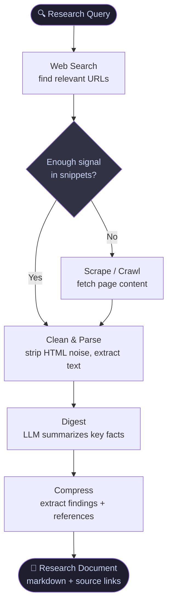

# slzr-researcher

> Research subagent for Claude Code and OpenCode.
> Goal: find → clean → digest → compress → store. Minimize tokens, maximize signal.

Spawn it for any research task to keep your main context clean and token-efficient.

---

## Pipeline



| Step | What happens | Token cost |
|------|-------------|------------|
| **1. Web Search** | Query → list of URLs + snippets | Low |
| **2. Scrape/Crawl** | Fetch pages — only if snippet isn't enough | High if raw HTML |
| **3. Clean & Parse** | Strip ads, nav, scripts → plain text | Saved here |
| **4. Digest** | LLM reads cleaned text → extracts facts | Medium |
| **5. Compress** | Findings written to file, raw content discarded | Context freed |
| **6. Store** | Markdown doc with inline references | Zero tokens in future |

**Key rule:** most research stops at step 1-2. Only go deeper when snippets are insufficient.

---

## Recommended stack

_Validated by benchmark — June 2026_

### Quality mode (default)
```
Search  →  Exa MCP            semantic results, 1k free/mo
Scrape  →  Jina Reader        r.jina.ai/<url>, unlimited, free
```

### Token budget mode
```
Search  →  Built-in WebSearch  unlimited, 2.3x cheaper than Exa
Scrape  →  Jina Reader         same
```

### Fallback escalation

| Symptom | Swap in |
|---------|---------|
| Exa 1k/mo limit hit | Brave Search MCP (2k/mo free) |
| Jina strips too much content | Firecrawl free tier (1k pages/mo) |
| Page needs login / clicks | Firecrawl interact |
| Self-hosted / air-gapped | Crawl4AI (open source, Apache 2.0) |

---

## Tools reference

### Search (Step 1)

| Tool | Free | Notes |
|------|------|-------|
| **Exa MCP** | 1k/mo | Semantic search — finds by meaning. **Winner.** |
| **Built-in WebSearch** | Unlimited | Already live, no setup. Best fallback. |
| **Brave Search MCP** | 2k/mo | Reliable, independent index. |
| **Tavily MCP** | 1k/mo | Built for AI agents, returns clean summaries. |
| **DuckDuckGo MCP** | Unlimited | No API key, keyword-only, noisier results. |

### Scrape + Clean (Steps 2-3)

| Tool | Free | Notes |
|------|------|-------|
| **Jina Reader** (`r.jina.ai/<url>`) | Unlimited | Prepend to any URL → instant clean LLM text. **Winner.** |
| **Firecrawl MCP** | 1k pages/mo | JS rendering, handles SPAs. Best fallback. |
| **Crawl4AI** | Open source | Self-hosted, Apache 2.0. |

---

## Usage

**Claude Code**
```
Spawn a researcher agent to investigate: "best open source vector databases 2026"
Output to ./research-vector-dbs.md
```

**OpenCode**
```
@researcher best open source vector databases 2026
```

---

## Install

```bash
npx github:salazarr-js/skills
```

See [root README](../../README.md#install) for platform, scope, and manual curl options.

## Compatibility

| Platform | File | Model | Status |
|----------|------|-------|--------|
| Claude Code | `.claude/agents/slzr-researcher.md` | `sonnet` | ✅ |
| OpenCode | `.opencode/agents/slzr-researcher.md` | `anthropic/claude-sonnet-4-20250514` | ✅ |

### Learn more

- [Claude Code — Sub-agents](https://docs.anthropic.com/en/docs/claude-code/sub-agents) — frontmatter fields, scopes, model aliases, tools, permissions
- [OpenCode — Agents](https://opencode.ai/docs/agents/) — `mode: subagent`, `provider/model-id` format, `@mention` invocation, permission rules

---

## References

- [Exa MCP](https://exa.ai/mcp) — semantic search API
- [Jina Reader](https://jina.ai/reader) — URL to LLM text
- [Firecrawl MCP](https://github.com/firecrawl/firecrawl-mcp-server) — scrape + clean at scale
- [Crawl4AI](https://github.com/unclecode/crawl4ai) — open source AI crawler
- [Brave Search API](https://brave.com/search/api/) — independent search index
- [Tavily](https://tavily.com) — AI-agent search API
- [DuckDuckGo MCP](https://github.com/nickclyde/duckduckgo-mcp-server) — free keyword search
